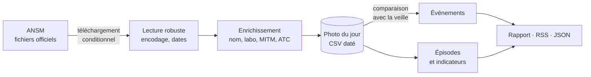

# 💊 veille-ruptures

[](https://github.com/naggaz-alae/projet4/actions/workflows/ci.yml)
[](https://pypi.org/project/veille-ruptures/)
[](https://pypi.org/project/veille-ruptures/)
[](https://mypy.readthedocs.io/)
[](https://github.com/astral-sh/ruff)
[](LICENSE)

**Surveiller les ruptures et tensions d'approvisionnement de médicaments en France.**

L'ANSM publie chaque jour l'état de disponibilité des médicaments… mais **pas son historique**.
`veille-ruptures` photographie cet état chaque jour, **détecte les changements** et
**reconstruit l'historique** : nouvelles ruptures, aggravations, remises à disposition,
durée des épisodes, médicaments d'intérêt thérapeutique majeur (MITM) touchés.

📘 [Documentation](https://naggaz-alae.github.io/projet4/) ·
📰 [Rapport du jour](donnees/RAPPORT.md) ·
📡 [Flux RSS](donnees/flux.xml)

```bash
pip install veille-ruptures
veille-ruptures etat --mitm --statut rupture
```

---

## Ce que fait l'outil

| | |
|---|---|
| **État du jour** | Ruptures et tensions, enrichies du nom du médicament, du laboratoire, du statut MITM et de la classe thérapeutique (ATC) |
| **Changements** | 🔴 nouvelle rupture · 🟠 nouvelle tension · ⬆️ aggravation · ⬇️ amélioration · 🟢 remise à disposition · ⚫ arrêt de commercialisation |
| **Historique** | Épisodes de rupture reconstruits jour après jour, avec leur durée |
| **Indicateurs** | Volumes, ancienneté médiane, classes et laboratoires les plus touchés |
| **Sorties** | Tableau, CSV, JSON, rapport Markdown, flux RSS |
| **Veille automatique** | Une GitHub Action photographie l'état chaque matin et publie rapport et flux |

## Exemples

*Sorties réelles de l'outil sur les données de test du projet (médicaments fictifs).*

```console
$ veille-ruptures etat --mitm
Statut   Médicament                  Laboratoire       MITM  Depuis
-------  --------------------------  ----------------  ----  ----------
Rupture  ANTALFICTIF 1 g, comprimé   LABORATOIRE BETA  oui   28/09/2026
Rupture  GASTROFICTIF 20 mg, gélule  LABORATOIRE BETA  oui   15/09/2026

2 présentation(s)
Source : ANSM, Base de données publique des médicaments (licence Etalab 2.0), données du 29/09/2026.
```

```console
$ veille-ruptures diff
Du 28/09/2026 au 29/09/2026 : 5 changement(s)

Événement                          Médicament                   Laboratoire        MITM
---------------------------------  ---------------------------  -----------------  ----
🔴 Nouvelle rupture                 ANTALFICTIF 1 g, comprimé    LABORATOIRE BETA   oui
🟠 Nouvelle tension                 CARDIOFICTIF 5 mg, comprimé  LABORATOIRE ALPHA
⬆️ Aggravation (tension → rupture) GASTROFICTIF 20 mg, gélule   LABORATOIRE BETA   oui
🟢 Remise à disposition             FICTIFAMOL 500 mg, comprimé  LABORATOIRE ALPHA
🟢 Sortie de la liste               DERMOFICTIF 1 %, crème       LABORATOIRE ALPHA
```

En Python :

```python
from veille_ruptures import Statut, etat_du_jour

etat, rapport = etat_du_jour()
ruptures_majeures = [d for d in etat if d.est_mitm and d.statut is Statut.RUPTURE]
```

## Commandes

| Commande | Rôle |
|---|---|
| `etat` | État du jour, filtrable par `--mitm`, `--statut`, `--atc`, `--labo` ; formats table, JSON, CSV |
| `instantane` | Enregistre la photo du jour |
| `diff` | Changements entre deux photos |
| `historique` | Épisodes reconstruits pour un médicament |
| `stats` | Indicateurs de synthèse |
| `rapport` | Rapport Markdown du jour |
| `flux` | Flux RSS ou JSON des derniers changements |

## Comment ça marche



**Choix techniques :**

- **Git scraping** : la source ne publie qu'un état ; une photo quotidienne commitée par une
  GitHub Action transforme l'historique Git en base de données historique.
- **Téléchargement conditionnel** (ETag / Last-Modified) avec cache local, et **mode dégradé**
  sur le cache en cas de panne réseau.
- **Lecture robuste** : fichiers sans en-tête, UTF-8 ou Windows-1252, dates françaises ;
  les lignes problématiques sont **signalées, pas fatales**.
- **Statuts lus depuis le libellé officiel**, pas depuis une table de codes figée :
  un nouveau statut ANSM est signalé au lieu de faire planter l'outil.
- **Tests par propriétés** (Hypothesis) : sur des milliers d'états aléatoires, comparer un état
  avec lui-même ne donne aucun événement, et rejouer les événements redonne l'état d'arrivée.
- **Une seule dépendance obligatoire** (`click`) ; pandas est optionnel.
- **Licence respectée par construction** : chaque sortie cite la source et la date des données.

## Qualité logicielle

- Packaging moderne : `pyproject.toml` (Hatch), dossier `src/`, `py.typed`, versionnage sémantique
- **ruff** (PEP 8, bugs probables) et **mypy `--strict`** sur tout le code
- **pytest** + Hypothesis, couverture minimale imposée à **90 %**
- **CI** à chaque pull request : lint, typage, tests sur **Python 3.10 à 3.13**, vérification du paquet
- **Publication PyPI automatique** à chaque Release, par **Trusted Publishing** (aucun secret stocké)
- **pre-commit**, documentation **MkDocs**, `CHANGELOG`, guide de contribution

## Développement

```bash
git clone https://github.com/naggaz-alae/projet4.git && cd projet4
python -m venv .venv && source .venv/bin/activate
pip install -e ".[dev,pandas]" && pre-commit install
pytest --cov && mypy && ruff check .
```

Voir [CONTRIBUTING.md](CONTRIBUTING.md).

## Données et avertissement

Données : **ANSM, Base de données publique des médicaments**, licence
[Etalab 2.0](https://www.etalab.gouv.fr/licence-ouverte-open-licence/).
Outil d'information **indépendant, non affilié à l'ANSM**. La référence officielle reste le
[site de l'ANSM](https://ansm.sante.fr/disponibilites-des-produits-de-sante/medicaments).
Ne remplace pas l'avis d'un pharmacien ou d'un médecin.

Code sous licence [MIT](LICENSE).
